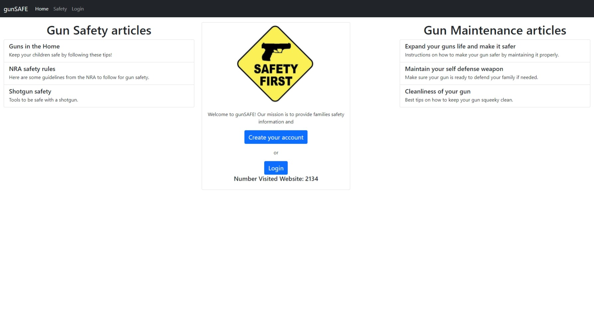
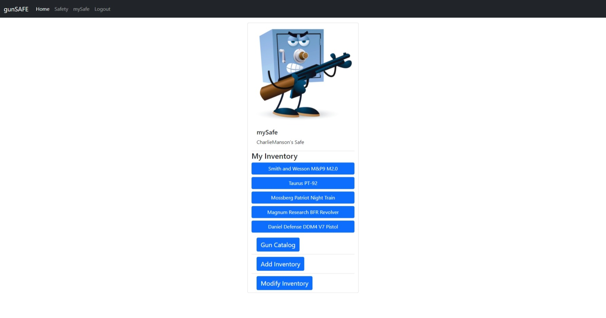
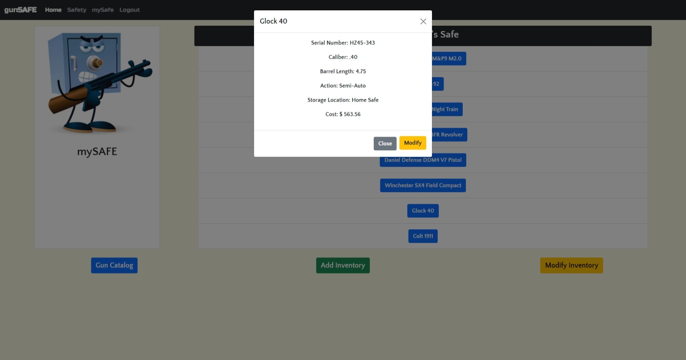
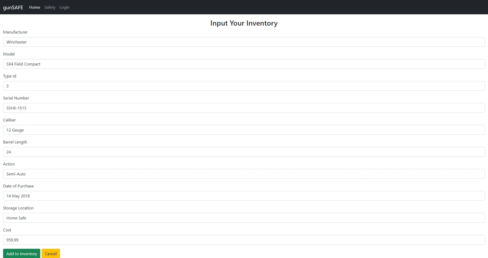
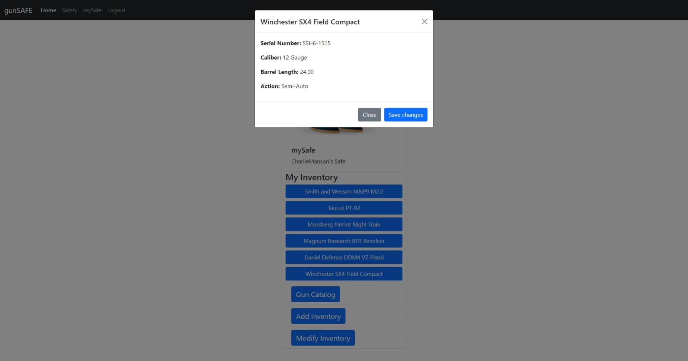
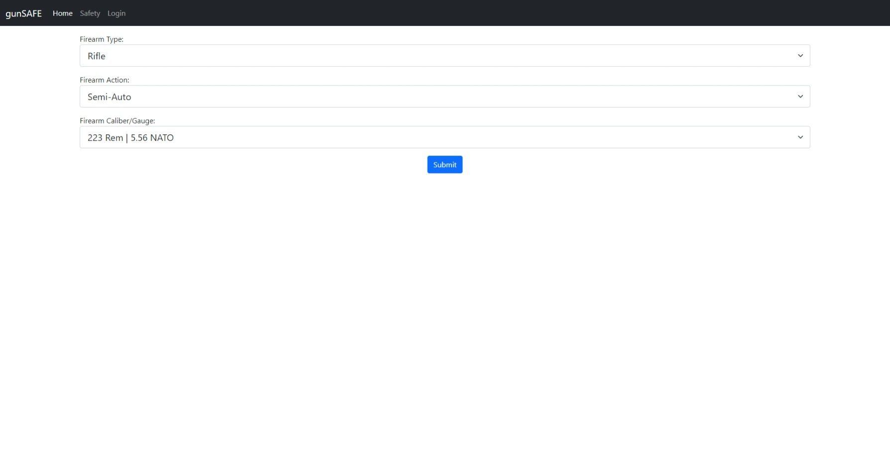
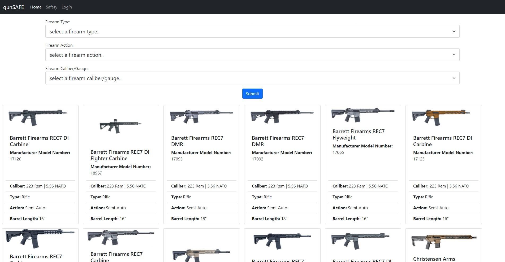

# Project Two:  gunSafe

  

***

  ## Description:
  This application is a repository of knowledge that gives a user general information and safety concerning firearms.  It gives gun owners and future gun owners a place to save their inventory into mySAFE dashboard. In addition, it gives gun owners safety and maintenance tips for their specific gun. 
  
***
  ## Table of Contents:
  1.  [Description](#description)
  2.  [Demonstration](#demonstration)
  3.  [Installation](#installation)
  4.  [Screenshots](#screenshots)
  5.  [Technologies](#technologies)
  6.  [Usage](#usage)
  7.  [License](#license)
  8.  [Contributing](#contributing)
  9.  [Tests](#tests)
  10.  [Questions](#questions)

***
  ## Demonstration:
  [Deployed website link](https://dashboard.heroku.com/apps/powerful-bastion-48444)

***
  ## Installation:
  To use this application, the user can fork or clone.  Then run `npm install`. See the technologies section for the application dependencies.  In addition, the user will need to connect to an active database server for full functionality.  However, any users may freely use this deployed application at the above deploy application website.

***
  ## Screenshots:
  ### (Deployed Application)
  

  ### (User Inventory)
  

  ### (Reviewing Inventory)
  

  ### (Adding Inventory)
  

  ### (New Inventory)
  

  ### (Catalog Search)
  

  ### (Catalog Search Results)
  

***
  ## Technologies
    - Node.js
    - Handlebars.js
    - MySQL2
    - Sequelize
    - Express-session
    - Dotenv
    - Bcrypt
    - Countapi-js 

  ## Usage:
  XXXXXX   This application utilizes several web and database technologies that allows a user to read technology blogs from other users and comment on blogs or write their own after signing up for access to the website.  A MySQL database is used to store user and blog post data.  The website has a secure authentication process to access the website for both current and new users.  This is an interactive website that allows the users to write new blogs, edit and delete their own blogs, view other user’s blogs, and make comments.  As stated earlier, a MySQL database manages the data, so the user does not have to work about the blog post being erased.  XXXXXXXXX
   
***
  ## License:
  This project falls under the MIT License.  The full documentation for this license can be found at [MIT Full Documentation](https://choosealicense.com/licenses/mit).

  Below is an excerpt of the MIT License.
   
  Copyright <YEAR> <COPYRIGHT HOLDER>
    
    Permission is hereby granted, free of charge, to any person obtaining a copy of this software and associated documentation files (the "Software"), to deal in the Software without restriction, including without limitation the rights to use, copy, modify, merge, publish, distribute, sublicense, and/or sell copies of the Software, and to permit persons to whom the Software is furnished to do so, subject to the following conditions:
    The above copyright notice and this permission notice shall be included in all copies or substantial portions of the Software.
    THE SOFTWARE IS PROVIDED "AS IS", WITHOUT WARRANTY OF ANY KIND, EXPRESS OR IMPLIED, INCLUDING BUT NOT LIMITED TO THE WARRANTIES OF MERCHANTABILITY, FITNESS FOR A PARTICULAR PURPOSE AND NONINFRINGEMENT. IN NO EVENT SHALL THE AUTHORS OR COPYRIGHT HOLDERS BE LIABLE FOR ANY CLAIM, DAMAGES OR OTHER LIABILITY, WHETHER IN AN ACTION OF CONTRACT, TORT OR OTHERWISE, ARISING FROM, OUT OF OR IN CONNECTION WITH THE SOFTWARE OR THE USE OR OTHER DEALINGS IN THE SOFTWARE.

  ## Contributing:
  To contribute to this project, please send an email.  
   
  The contributors for this project are:
    - Alexander Vadeboncoeur
    - Philip Perkins
    - Bryan Gee
    - D. Javan Worthy

***
  ## Tests:
  There are some test for this application.  The data/communication routes must be verified before this application can be properly deployed.  In addition, there must be an operational database  and it must be connected to the application to receive the full functionality.  

***
  ## Questions:
  - The GitHub profile for this project is https://github.com/djavanw/technology_blog.
 
  - If there are any questions, the contributor can be reached at fakemail@qmail.us.com.